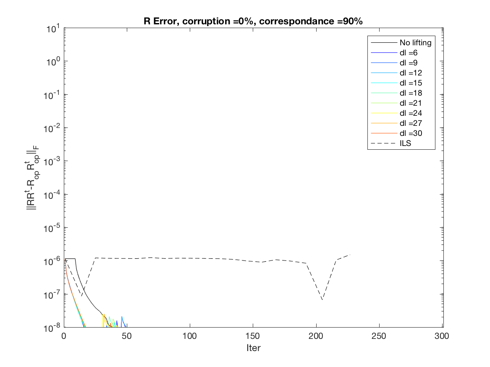
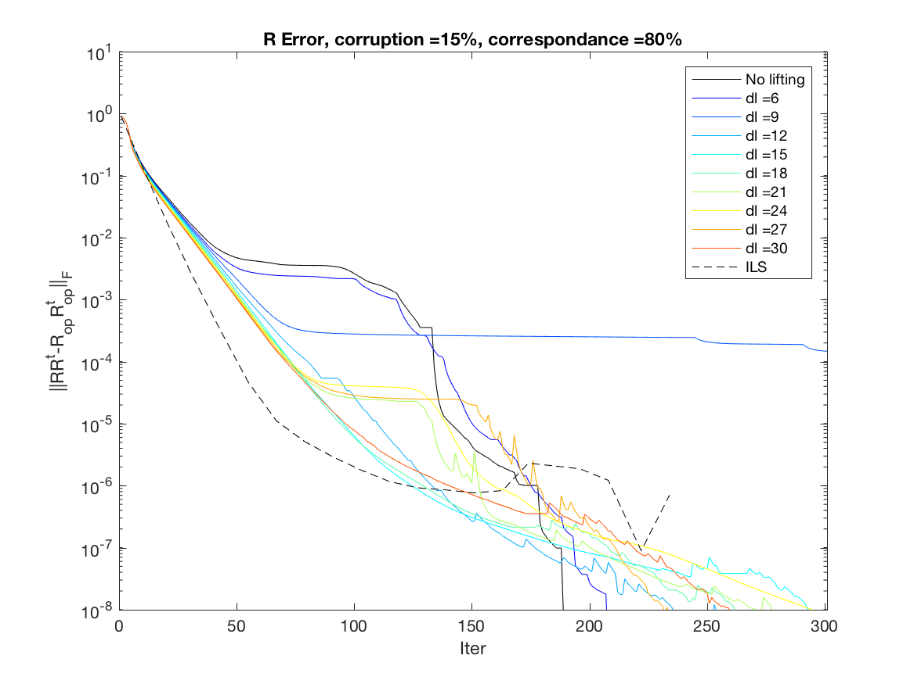
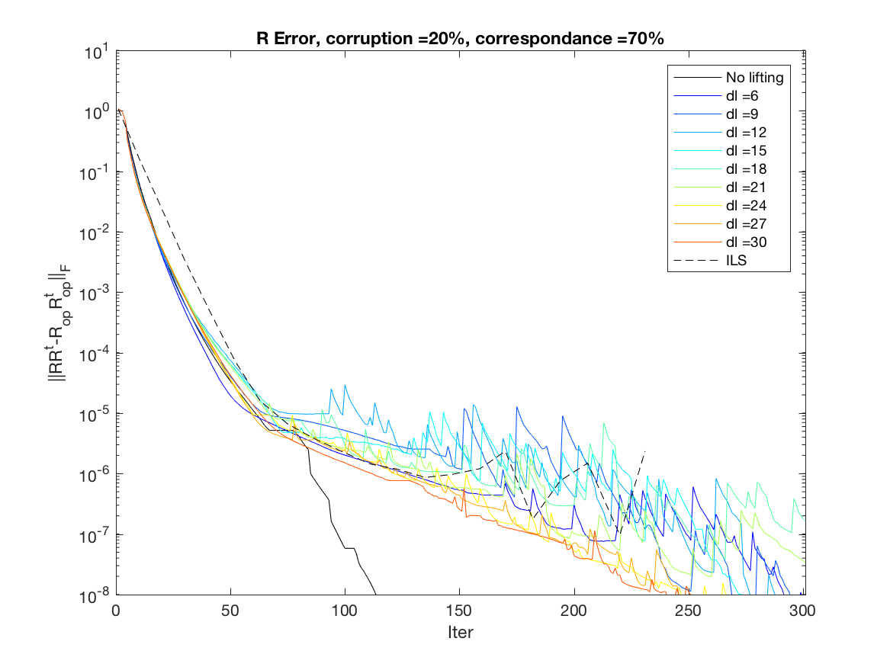
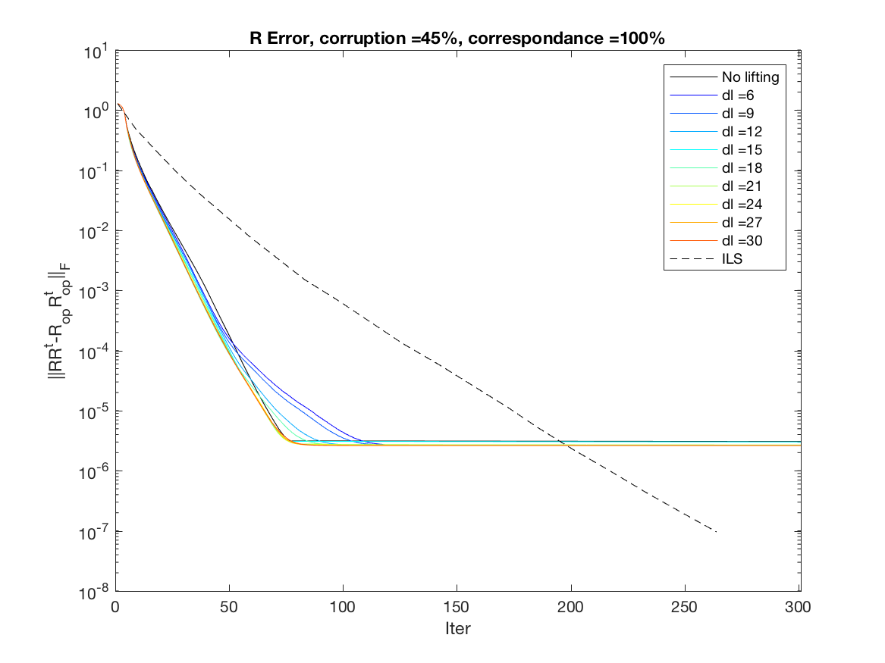
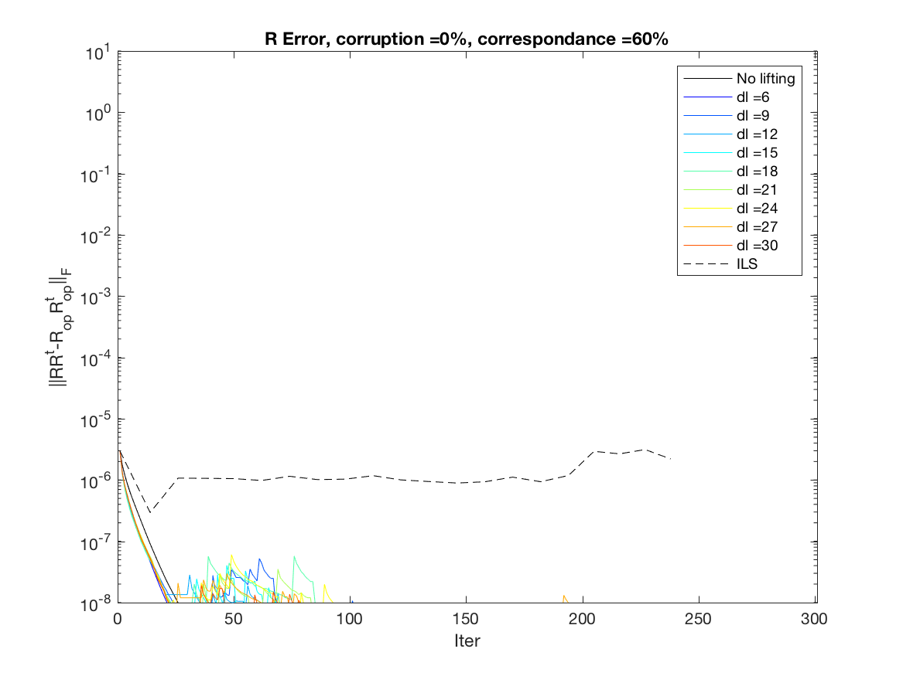
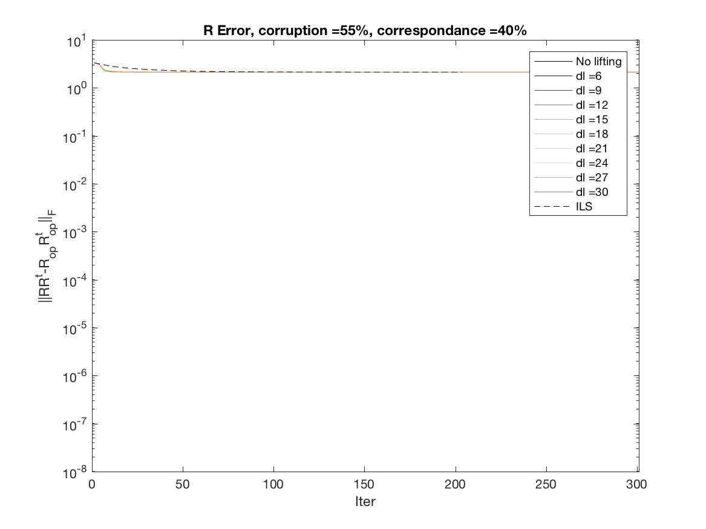
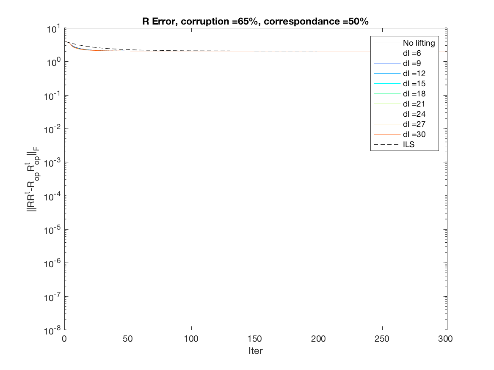

# Error according to correspondance and noise

Optimizing over O3 but starting at LS soluion

Number of points = 100

Number of images = 10

n\c = noise \ correspondance

n\c| 100 | 90 | 80 | 70  
:---:|:---:|:---:|:---:|:---:
0| |  | | 
5| |  | | 
10| |  | | 
15| |  | | 
20| |  | | 
25| |  | | 
30| |  | | 
35| |  | | 
40| |  | | 
45| |  | | 
50| |  | | 
55| |  | | 
60| |  | | 
65| |  | | 

n\c| 70 | 60 | 50 | 40  
:---:|:---:|:---:|:---:|:---:
0| |  | | 
5| |  | | 
10| |  | | 
15| |  | | 
20| |  | | 
25| |  | | 
30| |  | | 
35| |  | | 
40| |  | | 
45| |  | | 
50| |  | | 
55| |  | | 
60| |  | | 
65| |  | | 

